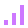

<!doctype html>
<html lang="ru">
<head>
  <meta charset="utf-8">
  <meta http-equiv="X-UA-Compatible" content="IE=edge">
  <meta name="viewport" content="width=device-width, initial-scale=1">
  <meta name="theme-color" content="#0b0f12">
  <title>Наш Sandbox — подключение</title>
  <link rel="stylesheet" href="./styles.css">
</head>
<body class="theme-bigcity">
  

    

    

    

    
<i></i><i></i><i></i><i></i><i></i><i></i><i></i><i></i><i></i><i></i><i></i><i></i>

    
<i></i><i></i><i></i><i></i><i></i><i></i><i></i><i></i><i></i>

    

    

    

    

  

  <main class="screen">
    <header class="topbar">
      

        
        

          <strong id="serverNameTop">Наш Sandbox</strong>
          Garry's Mod Community
        

      

      

        SandboxCore v0.24.0
        <b></b>подключение
        gm_bigcity_improved_rp
      

    </header>

    <section class="hero">
      

        
 СВОБОДНЫЙ SANDBOX ДЛЯ СВОИХ ИДЕЙ

        

          НАШ
          <h1>SANDBOX</h1>
          
<i></i><b>БОЛЬШЕ ЧЕМ ПРОСТО СЕРВЕР</b><i></i>

        

        
Строй <i>•</i> Сражайся <i>•</i> Экспериментируй

        
Выбирай свой стиль игры. Строитель получает свободу для творчества, PvP — полноценный боевой режим. Остальные системы работают тихо и не мешают песочнице.

        

          <article class="mode-card builder-card">
            01
            

            

              РЕЖИМ
              <strong>Строитель</strong>
              Создавай без ограничений и случайных перестрелок.
              
<em>без PvP-урона</em><em>noclip</em>

            

          </article>

          <article class="mode-card pvp-card">
            02
            

            

              РЕЖИМ
              <strong>PvP</strong>
              Полноценные сражения с боевыми ограничениями.
              
<em>полный урон</em><em>noclip off</em>

            

          </article>
        

      

      <aside class="info-card">
        

          

            ПОДКЛЮЧЕНИЕ К СЕРВЕРУ
            <h2 id="serverName">Наш Sandbox</h2>
          

          
        

        

          

            
            
Карта<strong id="mapName">gm_bigcity_improved_rp</strong>

          

          

            
            
Режим<strong id="gameMode">sandbox</strong>

          

          

            
            
Слоты<strong id="maxPlayers">—</strong>

          

        

        
ОСОБЕННОСТИ СЕРВЕРА<i></i>

        

          

<strong>Зелёная зона</strong>Безопасный spawn и общение

          

<strong>Прогрессия</strong>Достижения, титулы и лидеры

          

<strong>Защита сервера</strong>Адаптивный TPS и anti-crash

          

<strong>Голосовой чат</strong>Локальный и глобальный режимы

        

        

          
?

          

            
ПОДСКАЗКАF2

            
Меню сервера и выбор режима.

          

        

      </aside>
    </section>

    <section class="connection-panel" aria-live="polite">
      

        
1
<strong>Сервер</strong><small>информация</small>

        
        
2
<strong>Контент</strong><small>Workshop</small>

        
        
3
<strong>Lua</strong><small>клиент</small>

        
        
4
<strong>Вход</strong><small>в игру</small>

      

      

        

          ПОДКЛЮЧЕНИЕ
          <strong id="statusText">Получаем информацию о сервере…</strong>
          Подготавливаем клиент…
        

        

          

            ожидаем данные
            <strong id="progressNumber">—</strong>
          

          

            

            

          

          файлы: —
        

      

    </section>

    <footer class="footer">
      

        
F2<b>меню сервера</b>

        
TAB<b>игроки</b>

        
V<b>голосовой чат</b>

      

      
ИГРАЙ <i>•</i> СОЗДАВАЙ <i>•</i> ОБЩАЙСЯ

      
Core v0.24.0

    </footer>
  </main>

  
  
</body>
</html>
